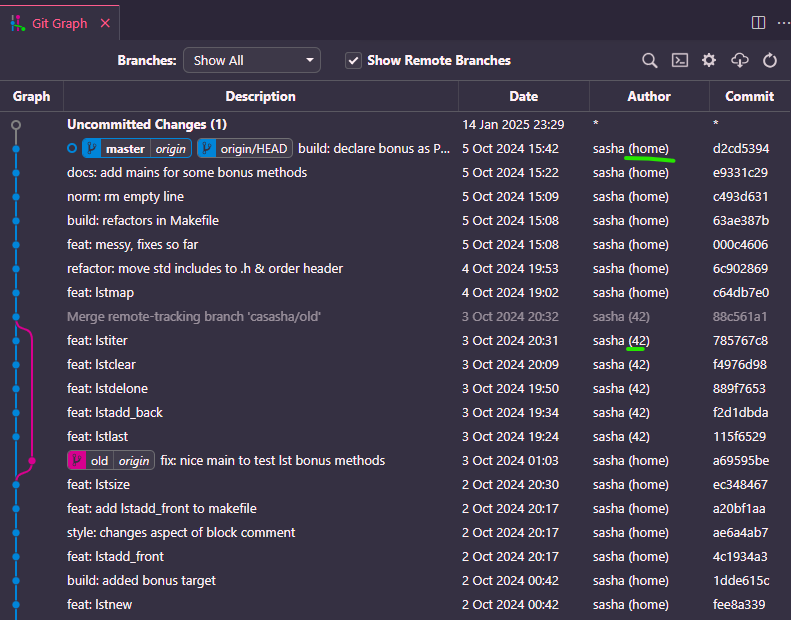

# guía para manejar varios remotos en git

## ¿por qué esta guía?

esto son unos apuntes para enseñar a usar git para trabajar cómodamente entre
los ordenadores de 42 y tu casa (o cualquier otro ordenador, vamos):

* sin tener que usar/conectar USBs/etc.
* manteniendo el historial/logs de commits idéntico

esto último viene muy bien para las reuniones *1to1*, después de haber
experimentado ya una y confirmarlo con el staff, ya que puedan ver en qué
fechas has estado trabajando aunque no estuvieras yendo a 42 en persona. ¿por
qué? porque si copias algo (archivo/s, carpeta/s...) de, e.g., un USB y lo
committeas todo de golpe, solo va a aparecer un commit de ese mismo momento y
no se va a reflejar cómo has estado trabajando días/semanas/meses anteriores

> me llamo Sasha, puedes usar cualquier pronombre conmigo y si tienes cualquier
> duda/pregunta, no dudes en contactarme por el Slack de 42 - `@facosta`

## disclaimer

me gustaría redactar algunas partes con más detalle/explicar correctamente.
de nuevo, no dudes es escribirme a mí o preguntar a tus compas para aprender :)

---

# varios remotos

A efectos prácticos, un remoto no es más que una dirección en la web a donde
 vas a subir tus cambios para que otras personas puedan acceder a tu trabajo. Si
 te cuesta visualizarlo, piensa en ello como en una nube (*Google Drive*, *Sharepoint*, *Dropbox*...) con la que te comunicas mediante comandos (`git pull`, `git checkout -b <nombre-de-rama>`...) en lugar de con una página web bonita con tu ratón.

La dirección de un repo en 42 tiene un aspecto parecido a esto:

```sh
git@vogsphere-v2.42madrid.com:vogsphere/intra-uuid-37017c37-f279-43c5-86b7-f629581e8a9b-6259240-facosta
```

Mientras que uno de github tiene esta pinta:

```sh
git@github.com:sashiyalala/n-remotes-42.git
```

Observa que comparten una estructura parecida

```sh
git @ una-url.com : algo / otra-cosa
```

Puedes investigar lo que es cada cosa, pero vamos, vamos a configurar git para
poder referirnos a repos de 42 y de GitHub de forma "sencilla" y evitando
confusiones entre ambos.

## crea una clave SSH para GitHub

Si recuerdas, en la piscina tuviste que configurar una **clave SSH** para
poder siquiera usar git. Es decir, mediante el algoritmo SHA, generar una
clave *pública* y otra *privada* que se guardan en archivos de tu
ordenador en 42 y pegar la pública en alguna parte de la intra para que el git
de 42 sepa que eres tú y darte permisos para subir cambios a tus propios
repositorios. Por ejemplo, tu cuenta de banco es pública porque la compartes
para enviarte dinero con otras personas pero el código de 3 números
en la parte de atrás de tu tarjeta (privada) solo lo conoces tú para autorizar
operaciones.

Estos archivos por defecto se suelen guardar en las rutas:

* `~/.ssh/id_rsa.pub` (la pública)
* `~/.ssh/id_rsa` (la privada)

Puede ser que al crearla les eligieras otro nombre.
No pasa nada, solo apúntate el nombre correcto de los archivos, lo vamos a
necesitar más adelante.

Si no te acuerdas, no pasa nada, vamos a repetirlo, pero **SIN BORRAR LA CLAVE
QUE YA TIENES EN 42**.

Vas a seguir este tutorial: https://docs.github.com/es/authentication/connecting-to-github-with-ssh/generating-a-new-ssh-key-and-adding-it-to-the-ssh-agent?platform=linux
prestando atención a estos detalles:

* Le vas a indicar tu correo **asociado a tu cuenta de GitHub** en este paso
```sh
ssh-keygen -t ed25519 -C "your_email@example.com"
```
* En el paso en el que te pregunta por el archivo donde guardar la clave,
asegúrate de que la ruta da un nombre de archivo diferente al de 42 que ya
tienes.
```sh
 Enter a file in which to save the key (/home/YOU/.ssh/id_ALGORITHM):[Press enter]
```
Por ejemplo, `/home/.../.ssh/id_edXXXX`

También apúntate este nombre, lo vamos a necesitar también.

* recuerda que el *passphrase* es como una contraseña. Si confías en 42 hehe
no hace falta que des ninguna, así más adelante no te preguntará por ella cuando
uses el usuario de github...

Sigue el tutorial y asegúrate! de que añades tu clave al `ssh-agent`:
https://docs.github.com/es/authentication/connecting-to-github-with-ssh/generating-a-new-ssh-key-and-adding-it-to-the-ssh-agent?platform=linux#adding-your-ssh-key-to-the-ssh-agent

Después de añadirlo al *agent*, sigue este tutorial para añadir tu clave a tu cuenta de GitHub siguiendo
este tutorial: https://docs.github.com/es/authentication/connecting-to-github-with-ssh/adding-a-new-ssh-key-to-your-github-account

y ya estaría!

## Añade configuración para tus remotos

Como muchas otras cosas en UNIX, la configuración de cosas suele poder
alterarse/customizarse con archivos en tu carpeta de usuario (i.e., `~`).

Como vamos a querer usar claves para un usuario de git de 42 y otro de GitHub
a la vez, vamos a escribir una configuración para evitarle confusiones al
ordenador (y errores a nosotros)

Esto se hace en el archivo `~/.ssh/config`. Si no existe, créalo y/o edítalo
como prefieras: por terminal con *nano*, *vim*, con apps como *VSCode*...

Y vas a añadirle esto:

```sh
Host github.com
	HostName github.com
	User git
	IdentityFile ~/.ssh/<nombre-de-tu-clave-privada-de-GITHUB>
Host git.42
	HostName vogsphere-v2.42madrid.com
	User git
	IdentityFile ~/.ssh/<nombre-de-tu-clave-privada-de-GIT-EN-42>
```

En mi caso, lo tengo parecido a esto:

```sh
Host github.com
	HostName github.com
	User git
	IdentityFile ~/.ssh/id_edXXXX
Host git.42
	HostName vogsphere-v2.42madrid.com
	User git
	IdentityFile ~/.ssh/id_rsa
```

Se puede explicar con más detalle y te invito a investigar qué significa todo
esto, pero básicamente le estamos diciendo al comando de UNIX `git`:

> *oye, cuando me comunique con repos en github.com, tienes que usar la clave*
> *de mi usuario que está en la ruta `~/.ssh/id_edXXXX`.*
> *sin embargo, cuando el repo sea de `vogsphere-v2.42madrid.com`, tienes que*
> *usar la clave que está en la ruta `~/.ssh/id_rsa`. Por cierto, la dirección de*
> *`vogsphere-v2.42madrid.com` me parece muy larga, así que la abreviaré a*
> *`git.42`*

A fin de cuentas, el comando `git` no es omnisapiente, así que le tenemos que
 ayudar a no liarse entre varios repos y claves.

Por si acaso, cierra y vuelve a abrir tu terminal antes de continuar para
asegurar que la configuración cobra efecto.

# flujo de trabajo con varios remotos

algo importante antes de crear ningún repositorio en GitHub
## usar mismo nombre de rama principal

hace unos años, en github decidieron que la rama por defecto se llamaría `main`
en vez de `master`.

sin embargo, en 42 la rama principal se sigue llamando `master` por defecto.
yo prefiero y creo que es muy importante que lo primero que hagas es configurar
tu GitHub para que la rama por defecto se llame siempre `master` porque osino
creo que va a ser caótico cuando hagas `git push`.

Para ello, sigue esta guía: https://docs.github.com/en/account-and-profile/setting-up-and-managing-your-personal-account-on-github/managing-user-account-settings/managing-the-default-branch-name-for-your-repositories
 y elige el nombre "master".
Ahora, todos tus repos nuevos en GitHub deberían usar el nombre `master` para la
rama principal.

## guía de flujo de trabajo normal

> otra vez, se puede detallar/explicar más en detalle por qué hago estas cosas
> y/o lo que significa, pero voy a dejar unos apuntes a modo de cheatsheet para
> que puedas trabajar cómodamente en tu repo de 42

### clonar repo de 42
En tu máquina de 42, abre la terminal y elige dónde quieras clonar tu repo de un proyecto.
Clónalo, pero cambiando `vogsphere-v2.42madrid.com` por `git.42`:

```sh
git clone git@git.42:vogsphere/intra-uuid-37017c37-f279-43c5-86b7-f629581e8a9b-6259240-facosta mi_proyecto
```

### revisa que solo tienes el remoto de 42 aún

vete dentro de la carpeta y ejecuta el comando `git remote -v`, que te enseña todos los remotos disponibles que tienes, e.g.:

```sh
➜  mi_proyecto git:(master) git remote -v
origin  git@git.42:vogsphere/intra-uuid-37017c37-f279-43c5-86b7-f629581e8a9b-6259240-facosta (fetch)
origin  git@git.42:vogsphere/intra-uuid-37017c37-f279-43c5-86b7-f629581e8a9b-6259240-facosta (push)
```

Observa que sale la URL que le hemos pasado a git cuando hemos hecho el `clone`!
¿Pero sale en 2 elementos diferentes?
Con `(fetch)` y `(push)` al final.
Esto es normal.

> te recomiendo que te revises la diferencia que hay entre las acciones `push` (subir tus cambios al remoto/a la "nube") vs `fetch` (actualizarte en tu máquina para ver si hay nuevos cambios disponibles en la nube, e.g. subidos por un compañero a otra rama) y ya de paso tbn vs. `pull` (traer a tu máquina los cambios que hay en la "nube"/el remoto)

**OBSERVA** que al principio del resultado, sale la palabra `origin`.
Igual que `master` o `main` es como se suele llamar a la rama principal por defecto, al remoto por defecto se le llama `origin`.

A efectos prácticos es un apodo de tu "remoto" para no tener que escribir la URL del repo entero cada vez.

y también, como suele haber solo un remoto, se omite.
Por ejemplo `git push` es realmente `git push origin` donde `origin` está *implícito*.
Significa:

>*oye, los commits que aún no estén en el remoto, a.k.a `origin`, súbemelos al remoto, para que mi compañero o yo desde otra máquina, pueda verlos :)*

> cuidado porque no siempre es lo mismo poner o no poner origin


### crea tu repositorio en GitHub

vete a GitHub y con tu cuenta créate un repositorio.
recuerda que puedes elegir hacerlo "privado" por si prefieres que sólo tú tengas acceso a ello, especialmente mientras trabajas en el proyecto.
pero si lo pones en público, luego lo puedes usar de portfolio ;) (siempre se puede cambiar más adelante)

eso sí, no clones este repo en tu máquina de 42.

simplemente ponte a trabajar en el repo y recuerda ir haciendo commits de vez en cuando (al menos 1 al día recomiendo) para que haya un registro de lo que has estado trabajando.

existen guías sobre cómo hacer commits, cómo escribir los mensajes...pero yo al menos creo que es prioritario usar git todo lo que puedas para que te acostumbres a usarlo, cojas experiencia, etc.

de hecho, observa que en realidad no hace falta toda la configuración de 42 para ponerte a hacer tu repo de GitHub y trabajar en él.
sólo acuérdate de configurar el nombre de la rama por defecto a `master` para evitar problemas más adelante

### añade el remoto de GitHub a tu repo de 42

en tu máquina de 42, en cuanto tengas cosas de "casa" que quieras subir, vas a hacer esto:

navega hasta tu carpeta del proyecto de 42 y copia la dirección para clonar tu repo de GitHub, e.g. `git@github.com:sashiyalala/n-remotes-42.git`

pero no clones nada!

vas a decirle a git que añada otro remoto con este comando

```sh
➜  mi_proyecto git:(master) git remote add <nombre-origen-nuevo> git@github.com:sashiyalala/n-remotes-42.git
```

donde en `<nombre-origen-nuevo>` vas a poner algo diferente a `origin` (para no liaros al ordenador ni a ti), pero *corto*, para que no sea costoso de escribir

yo por ejemplo lo suelo llamar `shorigin` (por la "sh" de mi nombre, no tiene ninguna historia...)

### revisar remotos después de añadir el de GitHub

si volvemos a preguntarle a `git` por los remotos disponibles, ahora deberían salir 4 resultados! 2 por la URL de 42 con nombre `origin` y 2 por la de GitHub, con el nombre que recién eligimos, e.g. `shorigin`
```sh
➜  mi_proyecto git:(master) git remote -v
origin  git@git.42:vogsphere/intra-uuid-37017c37-f279-43c5-86b7-f629581e8a9b-6259240-facosta (fetch)
origin  git@git.42:vogsphere/intra-uuid-37017c37-f279-43c5-86b7-f629581e8a9b-6259240-facosta (push)
shorigin        git@github.com:sashiyalala/n-remotes-42.git (fetch)
shorigin        git@github.com:sashiyalala/n-remotes-42.git (push)
```

Ahora, es muy importante que cada vez que hagas `git push/fetch/pull`, le indiques el remoto!

> creo que en teoría si no lo indicas, asumirá que te refieres a origin, pero por si acaso prefiero ponerlo cada vez...

### subir tus cambios de GitHub a 42 por primera vez en el proyecto

En el repo de 42 obviamente no va a haber nada (revisa con `git log` por ejemplo).
En cuanto tengas cosas que subir de GitHub, vas a tener que seguir estos pasos:

1. Dile a git que mire en GitHub para ver los commits disponibles
```sh
git fetch shorigin
```

2. Tráete/actualiza tu máquina de 42 para que se traiga los commits de GitHub
```sh
git pull shorigin master
```

3. Actualiza el repo de 42/sube a 42 los commits que tienes ahora en tu local (por el paso 2.) para que cualquier persona que se clone tu repo de 42 tbn los vea:
```sh
git push origin master
```

Si quieres, para revisar, vete a otra carpeta de tu terminal de 42 y clona el repo de 42 otra vez para ver que está todo subido :)


### y seguir

Observa que en

* máquina de 42 hay 2 remotos
* tu ordenador de casa/laptop/etc. solo uno

es decir, en tu ordenador externo, vas a seguir trabajando normal con un único remoto
> IMPORTANTE: no hemos tocado nada de la config de tu ordenador externo, así que ahí solo hay un remoto y se llama `origin`, porque es el único que hay por defecto. Sin embargo desde tu máquina de 42 vas a referirte a GitHub como `shorigin` o como hayas elegido.


Ahora, mientras trabajes en el repo del ordena de 42, vas a tener que hacer `git push` 2 veces:

```sh
git push origin
git push shorigin
```

y si tienes cambios en un remoto, vas a tener que hacer pull de ese remoto y luego push al otro para sincronizarlos.

esto puede ser muy lioso(si aún no te parecía suficiente...heh) y es normal. yo llevo 6 años usando git profesionalmente y hasta mi piscina hace medio año no me atreví a montar todo esto.

pero todo es ponerse, y si lo haces, que sea cuando tengas tiempo y no vayas con prisas.

a fin de cuentas, lo del USB tbn sirve, aunque sea "menos elegante". es más importante subir tus proyectos que no subir nada por liarte con git.


# bonus
si quieres que quede todo aún más bonito en los logs:

cuando hacemos un commit, git te suele pedir que hayas configurado el "*name*" y el "*email*".
hasta donde yo sé es solo estético para que se vea quién ha hecho qué commit en los logs

esto se configura en el archivo `~/.gitconfig`.

es un archivo que puedes editar tbn a mano y tiene que tener esta pinta:

```sh
➜  ~ cat ~/.gitconfig
[user]
        name = sasha (home)
        email = facosta@student.42madrid.com
```

este es mi archivo de `.gitconfig` en mi ordenador externo.
Observa que en "name" he puesto "`sasha (home)`".

Sin embargo, en la máquina de 42, tengo puesto esto:
```sh
➜  ~ cat ~/.gitconfig
[user]
        name = sasha (42)
        email = facosta@student.42madrid.com
```

y así consigo que en el git log no solo aparezca mi nombre, sino tbn una ayuda de dónde he hecho cada commit :)
por ejemplo, este es el aspecto de mis logs en el repo de GitHub de `libft` desde mi ordenador externo:



> (info) esto es una captura de la extensión "Git Graph", gratuita en VSCode

Y en la columna "*Date*" aparece cada momento en el que he hecho cada commit.

Tengo que añadir una captura de lo que se ve desde mi máquina de 42, pero si lo hiciera, verías que el log, tendría los mismos commits con las mismas fechas y horas, que es justo lo que comentaba al principio que es útil para que pueda el staff ver que has estado trabajando en tu proyecto a pesar de no haberlo hecho en una máquina de 42.


muchas gracias por leer hasta aquí y suerte!!!!
